# 🔧Main Function

- 회원 가입, 비밀번호 찾기

  > 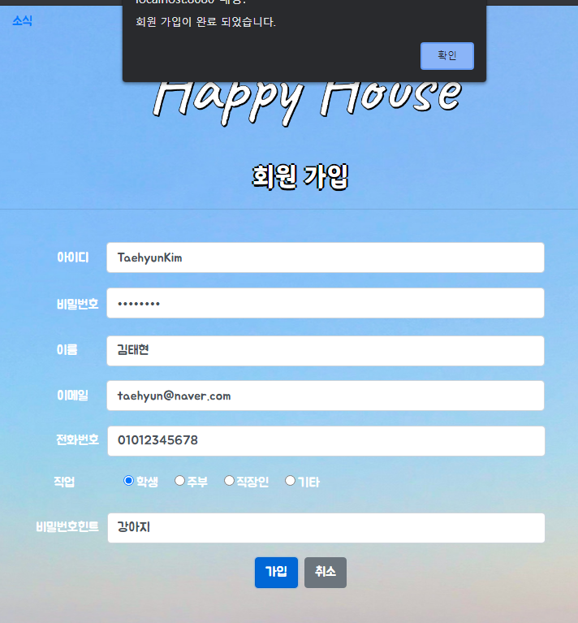
  >
  > 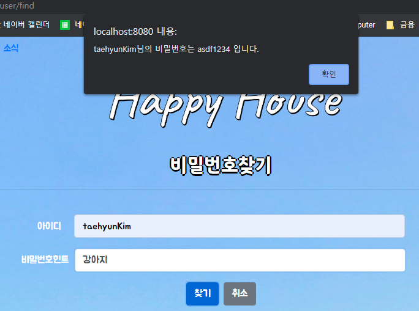

- 회원 목록 관리(관리자)

  > 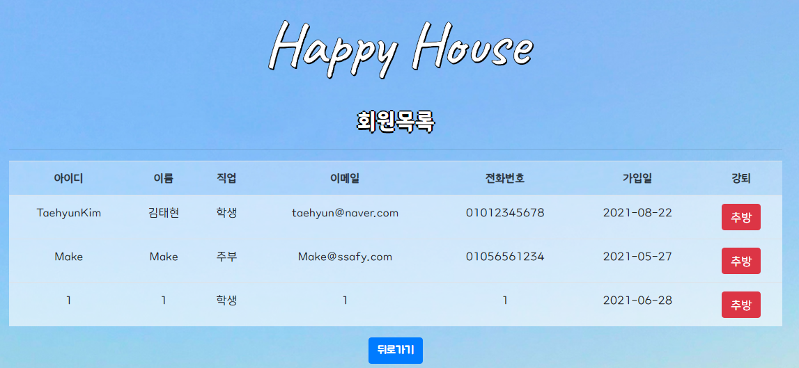

- 게시글 Create, Read, Update, Delete

  > 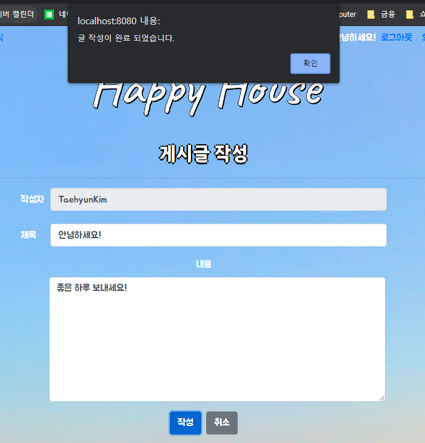
  >
  > 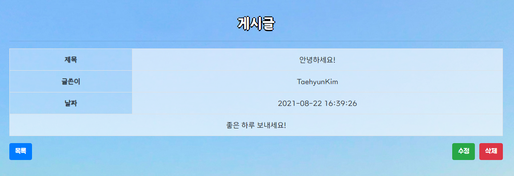
  >
  > 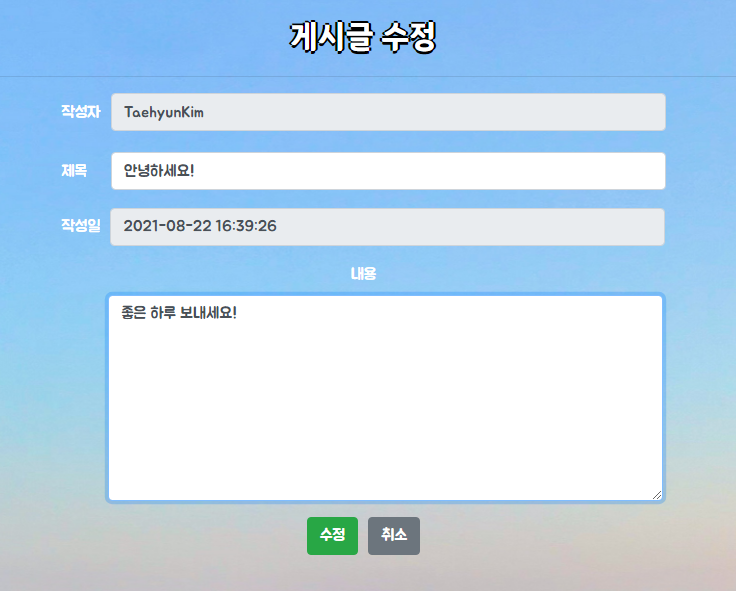
  >
  > 

- 검색 및 지도에 결과 띄우기

  > 

  > 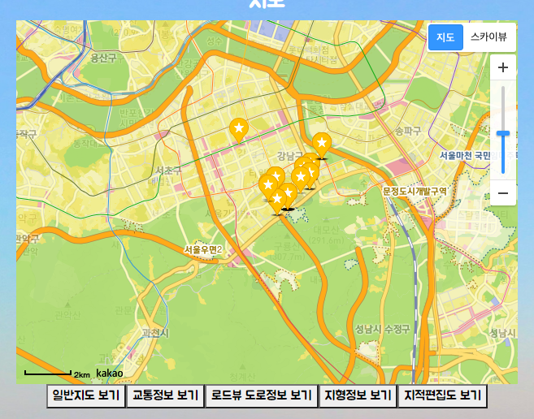

- 매물 찜하고, 삭제하기

  > 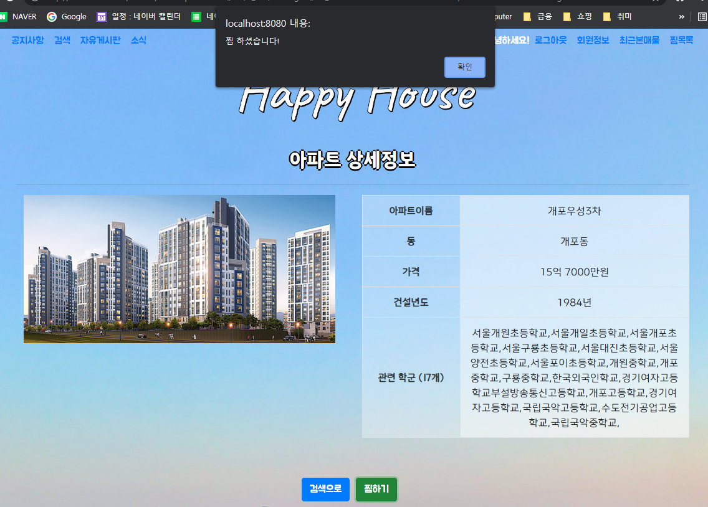
  >
  > 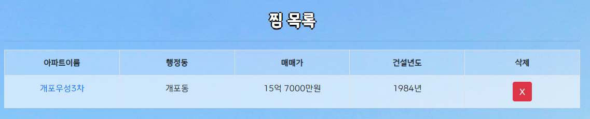

- 최근 본 상품 조회

  > 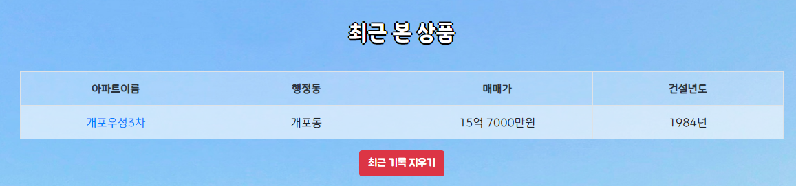

 

 

# ✏About Project

> ### Term : `2021.03 ~ 2021.06`

> ### Team
>
> - 김태현 : Front-End Developer
> - 조안나 : Back-End Developer

 

 

# ⚙Project Architecture

- Class Diagram

  

- ER Diagram

  

- Usecase Diagram

  

- API Architecture

  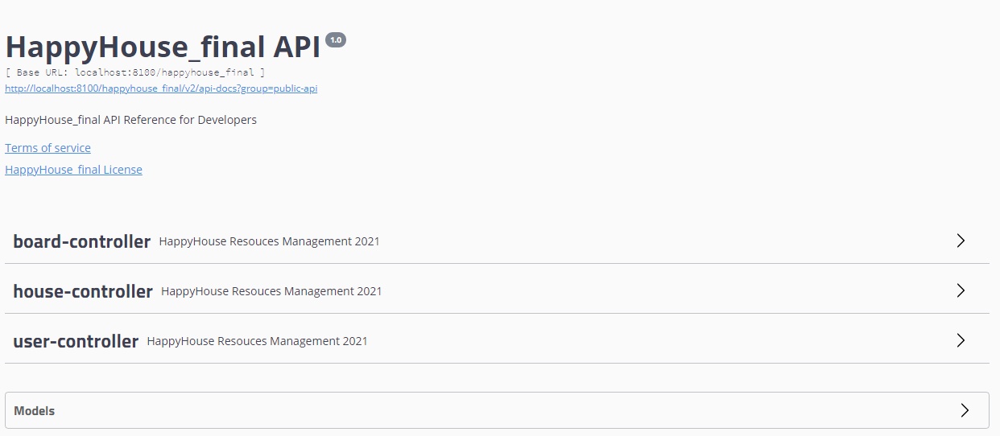

-  <a href="./설계서/View">Component Architecture</a>

  

 

 

# 💡Usage

## Vue Project

### Project setup

> npm install

### Compiles and minifies for production

> npm run build

### Compiles and hot-reloads for development

> npm run serve

 

 

# 🌏Environment

## FrontEnd

### IDE

- Visual Studio Code 1.59.0

### JavaScript

- Node.js 14.16.0

## BackEnd

### IDE

- STS-3.9.13.RELEASE

### Java

- OpenJDK 11.0.1

### Spring Boot

- spring boot 2.4.5
- Maven 3.8.1

## Database

- MySQL 8.0.23
